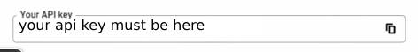
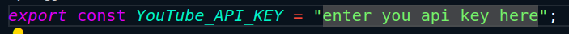

# Customized YouTube Clone

Welcome to the Customized YouTube Clone! This web application replicates the core functionalities of YouTube with additional customization features such as theme colors, font styles, and regional content preferences. This allows you to personalize your YouTube experience to your liking.

## Features

- **Theme Customization**: Change the theme colors of the website.
- **Font Customization**: Change the font of the entire website.
- **Regional Content**: Select your desired region (country) to watch content.

## Getting Started

To run this application, follow the steps below:

### Prerequisites

Ensure you have the following installed on your machine:

- Node.js and npm: [Install Node.js and npm](https://www.geeksforgeeks.org/how-to-install-node-run-npm-in-vs-code/)

### Setup

1. **Clone the Repository**
   ```bash
   git clone <repository-url>
   cd customized-youtube-clone
   ```
2. **Google Developers Console Setup**

   - Log in to the Google Developers Console [Google Developers Console](https://console.cloud.google.com/) using your Google account.
   - Create a new project.
   - On the new project dashboard, click Explore & Enable APIs.
   - In the library, navigate to YouTube Data API v3 under YouTube APIs.
   - Enable the API.
   - Create credentials to obtain an API key.
   - Copy the API key displayed on the screen.
   

   **[Youtube Video For More Help](https://www.youtube.com/watch?v=LLAZUTbc97I)**

3. **Configure API Key**

   **_ option 1 _**
   - Navigate to src/apikey.js in your project directory.
   - Paste the API key into the variable Youtube*API_key inside the single quotation marks.
   
   - Save the file.
   
   **_option 2 _**

   - Create a `.env` file in the root of the project.
   - Add your YouTube API key to the `.env` file like this:

   ```bash
      VITE_YOUTUBE_API_KEY= 'your_api_key_here';
   ```

4. Install Dependencies
   ```bash
       npm install
   ```
5. Run the Application

   ```bash
       npm run dev
   ```

## Personalisation

To Personalise the Web App according to your prefrence click on the user icon next to perofile icon on Navbar


> [!Note]
> ##Troubleshooting
> If you encounter any issues, ensure Node.js and npm are correctly installed. Refer to this guide for assistance: How to Install Node.js and npm.

## Running Demo of Customisable Youtube Clone


